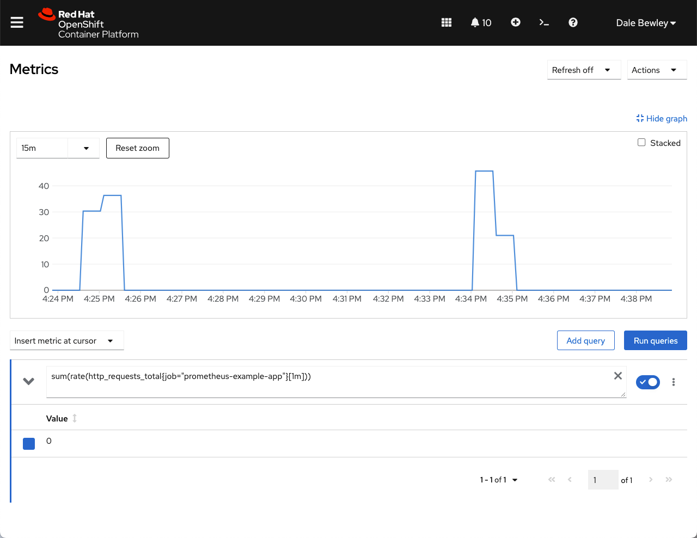

= Demo Using Custom Prometheus Metrics for OpenShift Autoscaling with KEDA
:ocp-ver: 4.11
:source-highlighter: rouge
:toc:[]

image:img/openshift-keda-autoscaling-sequence.png[]

Updated: {localdate}

.**Outline of Steps**
* Enable Prometheus user workload monitoring
* Install the Custom Metrics Autoscaler Operator and provision a KedaController
* Deploy an application with custom metrics target and an associated ServiceMonitor
* Create Thanos serviceaccount, token, role, rolebinding
* Configure authentication from Keda to Thanos
* Deploy sample application to autoscale based on above metrics
* Define deployment to be scaled and the metrics which trigger the scaling with ScaledObject

.**Docs and Refs**
* https://cloud.redhat.com/blog/custom-metrics-autoscaler-on-openshift
* https://access.redhat.com/articles/6636281[Knative versus KEDA]
* https://docs.openshift.com/container-platform/{ocp-ver}/monitoring/enabling-monitoring-for-user-defined-projects.html[Enabling user workload monitoring in OpenShift]
* https://docs.openshift.com/container-platform/{ocp-ver}/nodes/pods/nodes-pods-autoscaling-custom.html
* https://access.redhat.com/articles/6718611[Autoscaling for RGW in ODF via HPA using KEDA]
* https://docs.openshift.com/container-platform/{ocp-ver}/monitoring/managing-metrics.html 
* https://github.com/rhobs/prometheus-example-app
* https://keda.sh/docs/2.8/scalers/prometheus/
* https://access.redhat.com/articles/6675491[Enabling TLS in ServiceMonitor]
* https://github.com/marrober/pipelineBuildExample

== Prerequisites

=== Enable User Workload Monitoring

* https://docs.openshift.com/container-platform/{ocp-ver}/monitoring/enabling-monitoring-for-user-defined-projects.html[OpenShift user workload monitoring]

[source,bash]
----
oc extract configmap/cluster-monitoring-config \
   -n openshift-monitoring --to=-\
  | yq eval '.enableUserWorkload = true' - > config.yaml
oc set data configmap/cluster-monitoring-config \
  --from-file=config.yaml -n openshift-monitoring 
----

==== Confirm User Workload Monitoring 

Check that pods for prometheus-operator, prometheus-user-workload and thanos-ruler-user-workload are running in the openshift-user-workload-monitoring project. 

=== Granting non-admin users permission to monitor user-defined projects (optional)

.Roles
* `monitoring-rules-view` grants read access to PrometheusRule custom resources for a project.
* `monitoring-rules-edit` grants create, modify, and deleting PrometheusRule custom resources for a project.
* `monitoring-edit` grants `monitoring-rules-edit` plus create new scrape targets for services or pods. With this role, you can also create, modify, and delete ServiceMonitor and PodMonitor resources.

Grant `monitoring-edit` role.

include::operator/readme.adoc[leveloffset=+2]

include::custom-metric-app/readme.adoc[leveloffset=+1]

include::scaled-app/readme.adoc[leveloffset=+1]

== Managing metrics targets

As admin Observe -> Targets -> filter to 'keda-test' namespace. 

Target http://<ip-address>:8080/metrics corresponds to endpoint of service 'prometheus-example-app'

Go to Observe -> Metrics -> promql query and search for "version" to see metric from link:custom-metric-app[custom metric app].

https://docs.openshift.com/container-platform/{ocp-ver}/monitoring/managing-metrics-targets.html

== Testing Autoscaling

Create a job that will generate traffic to the link:custom-metric-app[custom metric app]. When the rate of traffic hits a 1 minute rolling average of 5 hits then the autoscaler will scale out the link:scaled-app[static-app deployment].

[source,bash]
----
oc create -f load.yaml
# wait roughly a minute...
oc get pods
NAME                                      READY   STATUS      RESTARTS   AGE
generate-requests-55gsw-vw92t             0/1     Completed   0          66s
prometheus-example-app-6dcf7dcf8b-hzbl9   1/1     Running     0          6h58m
static-app-1-build                        0/1     Completed   0          7h38m
static-app-6944df7b7b-4zdnl               1/1     Running     0          12s
static-app-6944df7b7b-6lfpz               1/1     Running     0          12s
static-app-6944df7b7b-752qk               1/1     Running     0          26s
static-app-6944df7b7b-9pgrl               1/1     Running     0          26s
static-app-6944df7b7b-g2s6s               1/1     Running     0          26m
static-app-6944df7b7b-h2qjm               1/1     Running     0          27s
static-app-6944df7b7b-ldpl6               1/1     Running     0          26s
static-app-6944df7b7b-q7qpc               1/1     Running     0          12s
static-app-6944df7b7b-zdd5b               1/1     Running     0          12s
----

Metrics will now show a spike on the custom metric.

